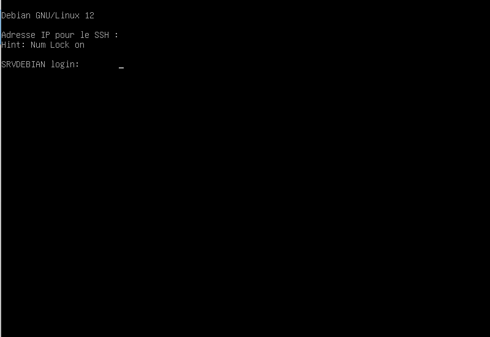
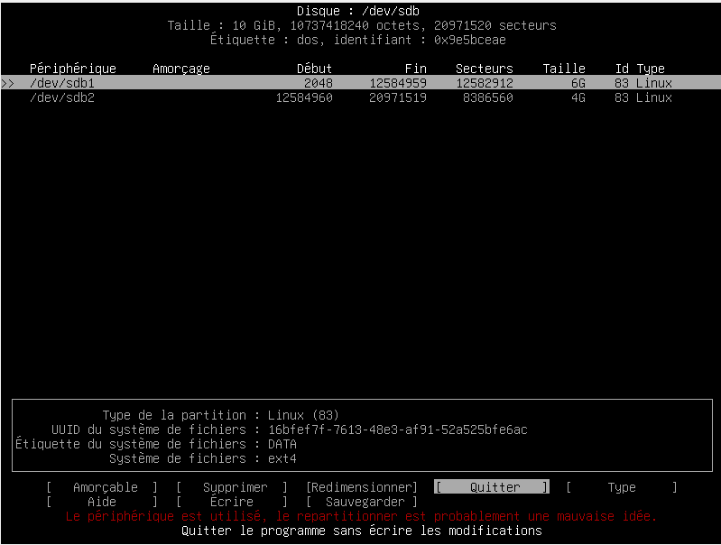
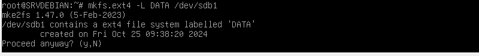
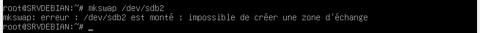
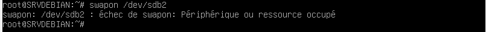
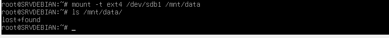
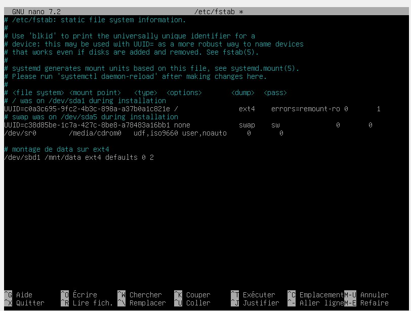
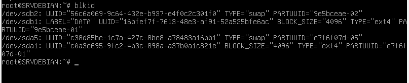
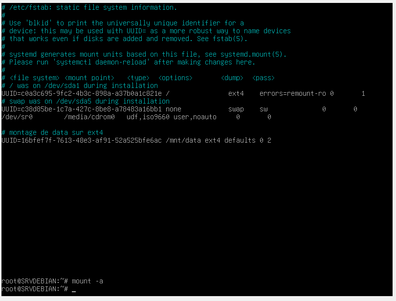
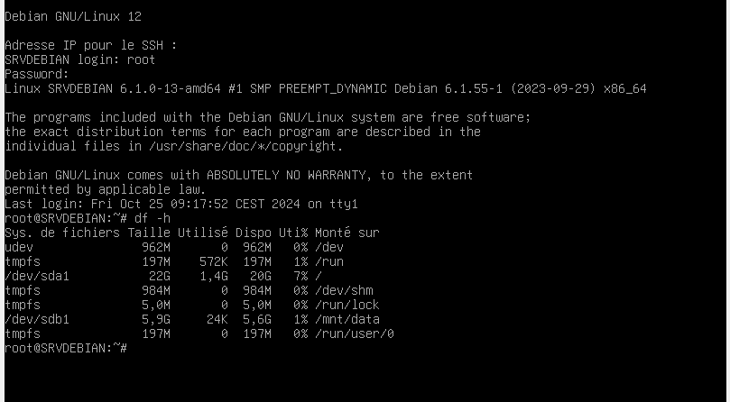

# Exercice 1 - Gestion du stockage (temps estimé : 1h30)

## 1.1 Préparation du disque

### Page login:

### Après avoir executer: cfdisk /dev/sdb

### Commande pour mettre le type ext4 nommée "DATA" sur le sdb1

### Commande pour mettre le type swap nommée "SWAP"

### Commande pour activer le swap

### Commande pour monté les partitions crées et formatées dans le dossier data

### Ligne du code pour faire un montage automatique au démarrage mais un message erreur lier au /dev/sdbd1

### Alors je vais utiliser la commande "blkid pour récuperer l'UUID du sdb1

### On remplace le sbd1 par par l'UUID puis on redémare la VM

### On vérifie si le /dev/sdb1 est monté sur /mnt/data

